# System Architecture

```mermaid
graph TD
    %% Frontend Components
    subgraph Frontend[Frontend - React/TypeScript]
        App[App.tsx]
        Chat[Chat Page]
        Admin[Admin Page]
        NotFound[404 Page]
        
        subgraph Components
            ChatInterface[ChatInterface]
            MessageInput[MessageInput]
            MarkdownRenderer[MarkdownRenderer]
            AdminPanel[AdminPanel]
            RealtimeStatus[RealtimeStatus]
            Header[Header]
            ThemeSwitcher[ThemeSwitcher]
        end
        
        subgraph Hooks
            useWebSocket[useWebSocket]
            useTheme[useTheme]
            useMobile[useMobile]
            useToast[useToast]
        end
    end

    %% Backend Services
    subgraph Backend[Backend - Express/Node.js]
        Server[Express Server]
        WebSocketServer[WebSocket Server]
        
        subgraph Services
            GitHubService[GitHub Service]
            OpenAIService[OpenAI Integration]
            MarkdownService[Markdown Parser]
            VectorStore[Vector Store]
        end
        
        subgraph Routes
            APIRoutes[API Routes]
            AdminRoutes[Admin Routes]
        end
    end

    %% Database
    subgraph Database[PostgreSQL Database]
        DocumentationStore[Documentation Storage]
        VectorIndices[Vector Indices]
        ConfigStorage[Configuration Storage]
    end

    %% External Services
    subgraph External[External Services]
        GitHub[GitHub API]
        OpenAI[OpenAI API]
    end

    %% Relationships
    App --> Chat
    App --> Admin
    App --> NotFound
    
    Chat --> ChatInterface
    Chat --> MessageInput
    Chat --> MarkdownRenderer
    
    Admin --> AdminPanel
    Admin --> RealtimeStatus
    
    ChatInterface --> useWebSocket
    AdminPanel --> useWebSocket
    RealtimeStatus --> useWebSocket
    
    Server --> APIRoutes
    Server --> AdminRoutes
    Server --> WebSocketServer
    
    APIRoutes --> GitHubService
    APIRoutes --> OpenAIService
    APIRoutes --> MarkdownService
    APIRoutes --> VectorStore
    
    GitHubService --> GitHub
    OpenAIService --> OpenAI
    
    VectorStore --> DocumentationStore
    VectorStore --> VectorIndices
    
    AdminRoutes --> ConfigStorage
    
    %% WebSocket Connections
    WebSocketServer <-.-> useWebSocket
    
    %% Database Connections
    Server --> Database
    
    %% Styling
    classDef frontend fill:#e1f5fe,stroke:#01579b
    classDef backend fill:#e8f5e9,stroke:#1b5e20
    classDef database fill:#fce4ec,stroke:#880e4f
    classDef external fill:#fff3e0,stroke:#e65100
    
    class Frontend,Components,Hooks frontend
    class Backend,Services,Routes backend
    class Database,DocumentationStore,VectorIndices,ConfigStorage database
    class External,GitHub,OpenAI external
```

## Component Descriptions

### Frontend Layer
- **App.tsx**: Main application component handling routing and layout
- **Pages**: Chat, Admin, and 404 pages
- **Components**: Reusable UI components for chat, documentation, and admin interfaces
- **Hooks**: Custom hooks for WebSocket, theming, mobile detection, and notifications

### Backend Layer
- **Express Server**: Main application server handling HTTP requests
- **WebSocket Server**: Real-time communication server
- **Services**: 
  - GitHub integration for repository access
  - OpenAI integration for AI features
  - Markdown parsing for documentation
  - Vector store for semantic search

### Database Layer
- **Documentation Storage**: Stores processed documentation content
- **Vector Indices**: Maintains semantic search indices
- **Configuration Storage**: Stores system configuration and settings

### External Services
- **GitHub API**: Access to documentation repositories
- **OpenAI API**: AI-powered features and processing

## Data Flow
1. Documentation is fetched from GitHub repositories
2. Content is processed and stored in PostgreSQL
3. Vector embeddings are generated for semantic search
4. Real-time updates are broadcasted via WebSocket
5. Frontend components receive and display data
6. User interactions trigger API calls and WebSocket messages
