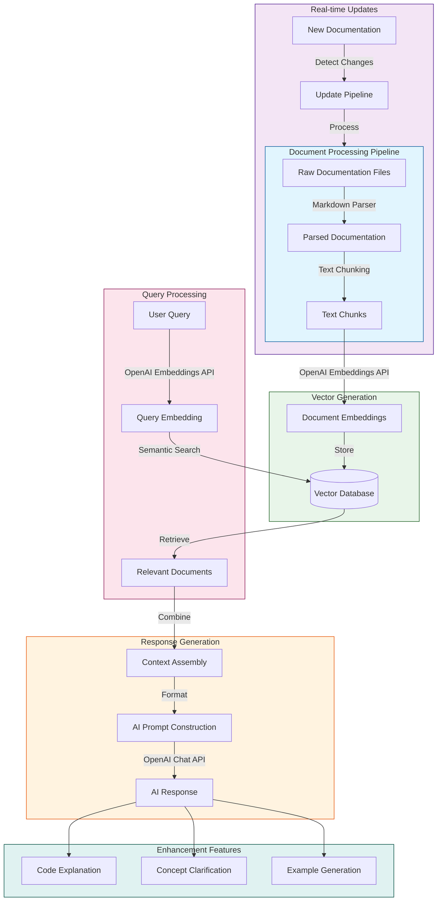

# Machine Learning Architecture

## ML Flow Description

### Document Processing Pipeline
1. **Raw Documentation Intake**: System ingests documentation files from various sources
2. **Parsing**: Converts raw documentation into structured format
3. **Chunking**: Breaks down documents into optimal-sized chunks for embedding

### Vector Generation Process
1. **Embedding Creation**: Generates vector embeddings using OpenAI's embedding model
2. **Vector Storage**: Stores embeddings in PostgreSQL with pgvector extension
3. **Index Management**: Maintains efficient vector indices for quick similarity search

### Query Processing Flow
1. **Query Vectorization**: Converts user queries into vector embeddings
2. **Semantic Search**: Performs similarity search against stored document embeddings
3. **Document Retrieval**: Fetches most relevant documentation chunks

### AI Response Generation
1. **Context Assembly**: Combines relevant documentation chunks
2. **Prompt Engineering**: Constructs effective prompts for the AI model
3. **Response Generation**: Uses OpenAI's Chat API to generate helpful responses

### Real-time Update System
1. **Change Detection**: Monitors for documentation updates
2. **Incremental Processing**: Updates only changed content
3. **Index Refresh**: Maintains vector index freshness

### Enhancement Features
1. **Code Explanation**: AI-powered code analysis and explanation
2. **Concept Clarification**: Detailed explanations of technical concepts
3. **Example Generation**: Dynamic generation of relevant examples
